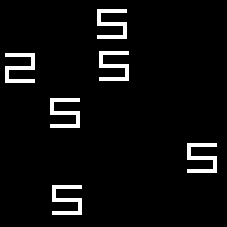

# searchstims

Python package to make stimuli like those used in classic visual search experiments  
https://en.wikipedia.org/wiki/Visual_search
... but with the exact size to feed them to your favorite neural network.

For a recent review of factors influencing visual search, please see:  
http://search.bwh.harvard.edu/new/pubs/FiveFactors_Wolfe-Horowitz_2017.pdf

## Installation
`pip install searchstims`

If you want to download locally and put install an environment with Anaconda:
`/home/you/Documents $ conda create -n searchstim python=3.6`  
`/home/you/Documents $ source activate searchstim`  
`(searchstim) /home/you/Documents $ git clone`  
`(searchstim) /home/you/Documents $ cd searchstims`  
`(searchstim) /home/you/Documents/searchstims $ pip install -e .`  

## Usage
The `searchstims` package installs itself so that you can run it from the
command line. You will use a config.ini file to specify what you want the
package to generate. See the example [config.ini](./config.ini) for details.
Running the example script will create a folder `~/output` with feature
search stimuli.  
`/home/you/Documents $ searchstims -c config.ini`
